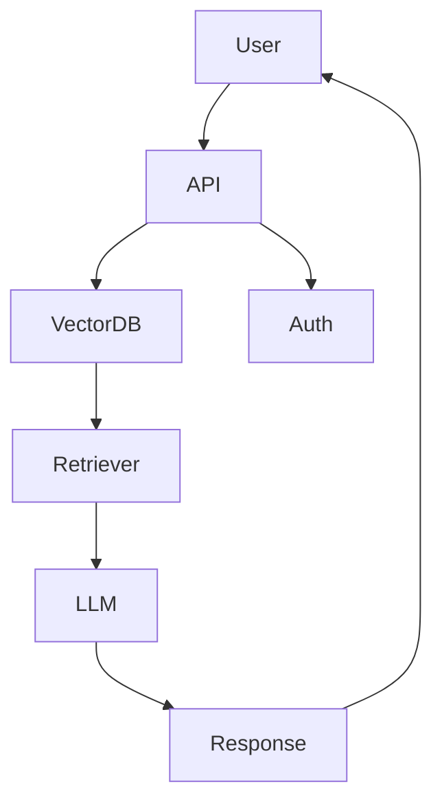
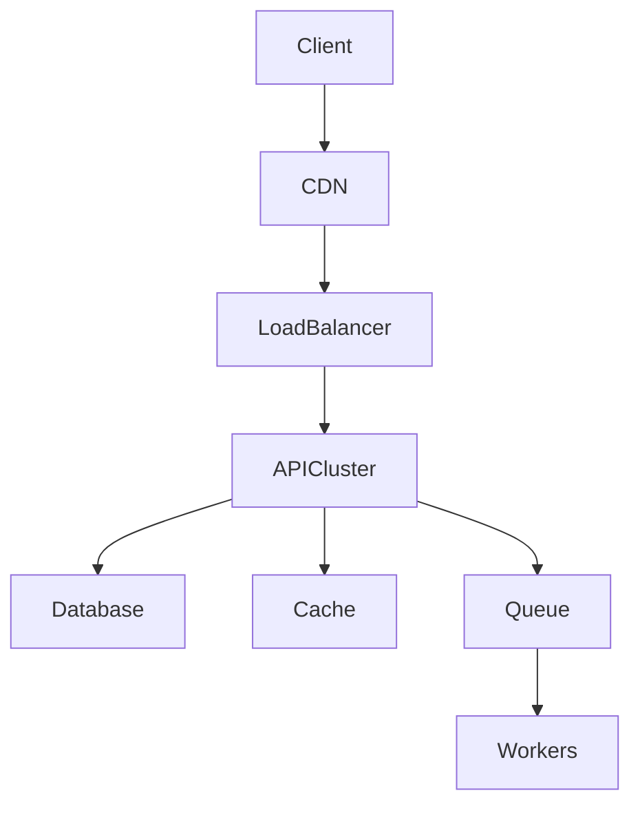

# 🚀 Everest Chima Ukweh

<p align="center">


</p>

<p align="center">


</p>

---

# 🧠 About

Senior **Full-Stack Engineer and AI Systems Developer** with **7+ years building scalable platforms** across:

* AI / LLM systems
* SaaS platforms
* fintech systems
* enterprise architecture
* cloud infrastructure

I focus on engineering systems that evolve through:

```
Concept → Architecture → Production → Global Scale
```

---

# 🔥 3D Animated Tech Stack

<p align="center">


</p>

---

# 📊 Live Developer Metrics Dashboard

<p align="center">


</p>

<p align="center">


</p>

---

# 📈 GitHub Contribution Heatmap

<p align="center">


</p>

---

# 📊 Coding Activity Dashboard (Wakatime)

<p align="center">


</p>

Shows:

* coding hours
* language distribution
* weekly productivity

---

# 🤖 AI Agents Projects

### AI Knowledge Agent

LLM assistant with:

* vector embeddings
* RAG retrieval pipeline
* AI memory layer
* LangChain orchestration

---

### AI Market Intelligence Agent

Features:

* forecasting models
* predictive analytics
* ML pipelines
* business intelligence outputs

[https://market-mind-frontend.vercel.app](https://market-mind-frontend.vercel.app)

---

### AI Customer Support Agent

Architecture:

* LLM conversation engine
* embeddings search
* support workflow automation

---

# 🧠 AI Research Lab

Current areas of exploration:

### LLM Systems

* fine-tuning LLMs
* RAG retrieval optimization
* vector search scaling

### Machine Learning

* survival prediction models
* sales forecasting models
* AI vs human image detection

### AI Infrastructure

* inference optimization
* AI SaaS architectures
* distributed AI pipelines

---

# 🧬 Interactive Architecture Diagrams

Example **AI platform architecture**



Example **scalable SaaS backend**



---

# 📦 Auto-Generated Project Portfolio

<p align="center">

<a href="https://github.com/relativity-codes?tab=repositories">


</a>

</p>

Top repositories will automatically appear in your **pinned section**.

Recommended pinned repos:

* AI platform
* LLM tools
* distributed backend
* ML experiments
* infrastructure automation

---

# 🧾 Open Source Impact

Contributions focus on:

* backend infrastructure
* developer tooling
* AI engineering patterns
* distributed system designs

---

# 🧠 Developer Reputation Badges

<p align="center">


</p>

---

# 🐍 Contribution Snake

<p align="center">


</p>

---

# 🌍 Languages

* English
* Igbo
* Hausa

---

# 📫 Contact

**Email**

```
ukweheverest@gmail.com
```

**LinkedIn**

```
linkedin.com/in/ukweheverest
```

**Portfolio**

```
relativity-codes.vercel.app
```

---

# ⚡ Engineering Philosophy

```
Great systems scale quietly.

The best architecture
solves today's problems
while anticipating tomorrow's complexity.
```

---
